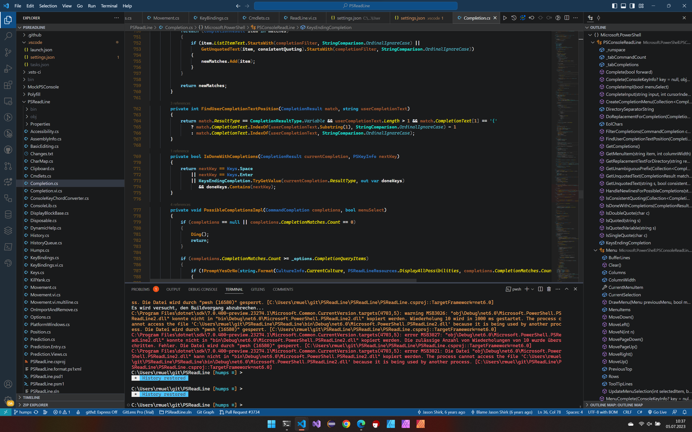
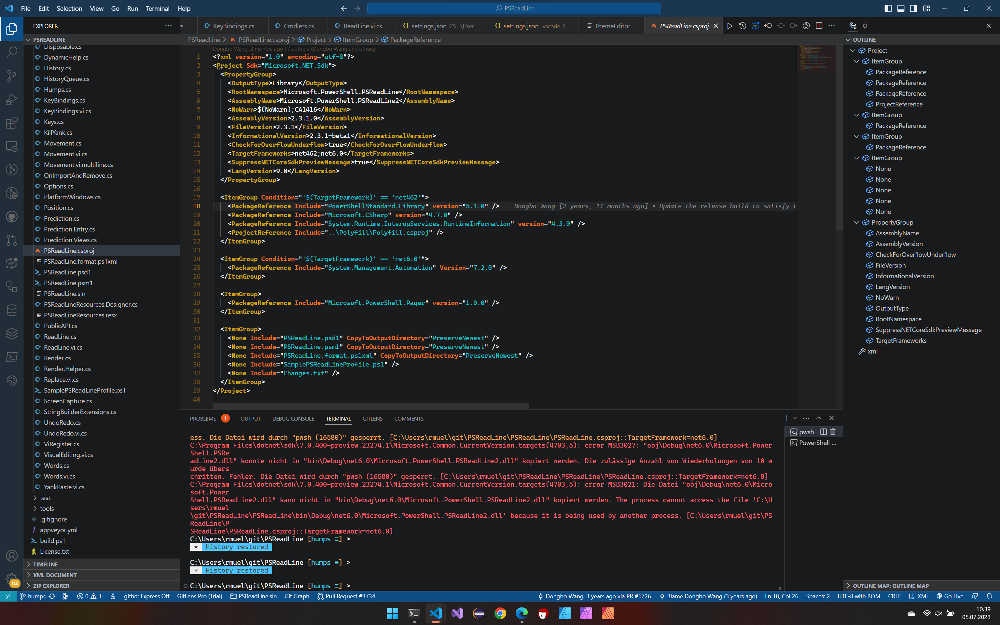

# Abstract
A Visual Studio Code Theme that reminds me of colorful but dark autumns.

# Screenshots

# Installation

Just copy the settings.json into your workspace under the `.vscode` Directory. That's it.

# Further improvements

Create VSCode Extension