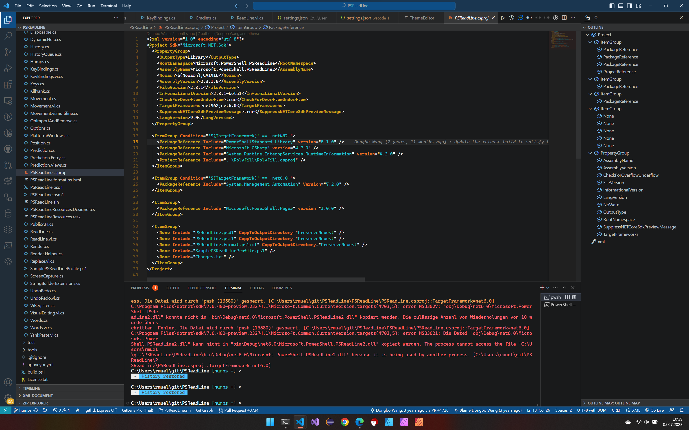

# Abstract
A Visual Studio Code Theme that reminds me of colorful but dark autumns.

# Screenshots

# Installation

Just install it via VS Code / Marketplace

# Further improvements

I didn't configure all languages, just what I needed. Sorry for that. I can of course add to this extension. Just write me.